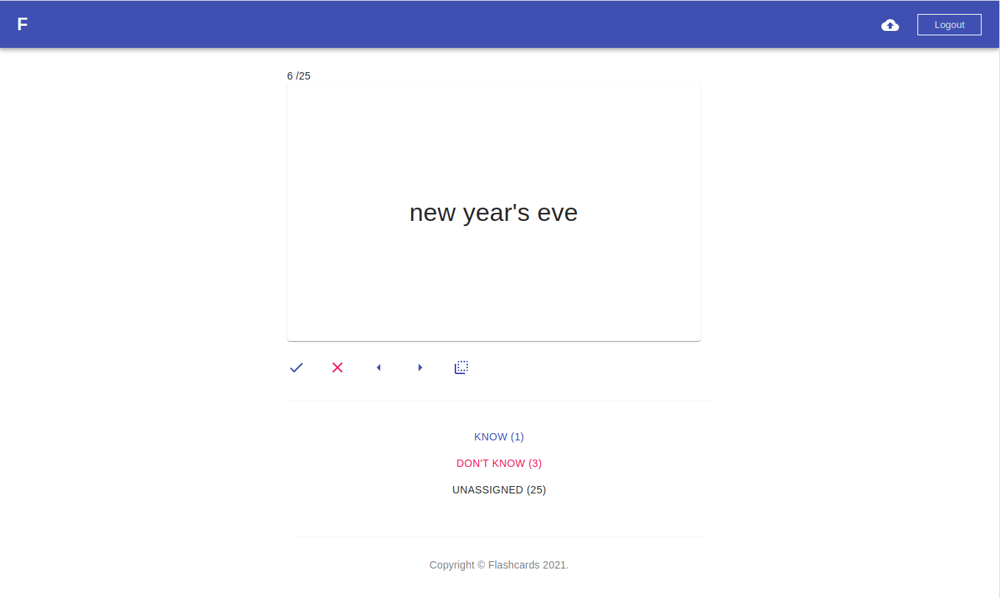

<h1>Flashcards application. Sample Spring + next.js + mongoDB</h1>
Flashcard app, with Google Translate integration.

<h2>Working demo</h2>
http://googleflashcards.us/

You can login to this app using your google account.

<h2>Installation</h2>
Few steps described below are required to install app locally. 

<h3>1. Create google application</h3>
You need `client-id` and `client-secret` .
Here is instruction how to create and configure Google App:
https://developers.google.com/google-ads/api/docs/oauth/cloud-project

<h3>2. Run docker</h3>
run `docker-compose up`

<h3>3. Run spring app</h3>
in `./src/main/resources/application.yml` paste your `client-id` and `client-secret`

then run

`./mvnw spring-boot:run`

<h4>If you dont have java installed locally</h4>
In case you don't have java installed locally, first install java:
```
sudo apt-get install openjdk-11-jdk
export JAVA_HOME=/usr/lib/jvm/java-11-openjdk-amd64
```

<h3>client</h3>
go to client folder `cd ./client`

In file `next.config.js` assign your `client-id` to const `GOOGLE_ID`

Then run:

```
npm install
npm run dev
```

<h3>Open project in the browser</h3>
go to http://localhost:3000 
After login, follow the instructions to import translations from Google Translate.



<h2>License</h2>
The flashcards sample application is released under version 2.0 of the
<a href="https://www.apache.org/licenses/LICENSE-2.0" rel="nofollow">Apache License</a>